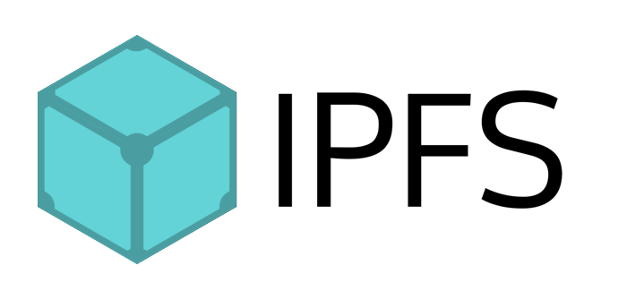

# IPFS-API
## Decentralized File System (IPFS) API using NodeJS
https://ipfs.io/
API simple hecha con NodeJS y Express que permite subir ficheros al sistema descentralizado IPFS para luego poder recuperarlos mediante el hash.

#### Explicación en vídeo (Pincha en la imagen)
IPFS API con NodeJS y Express | Tutorial en español

